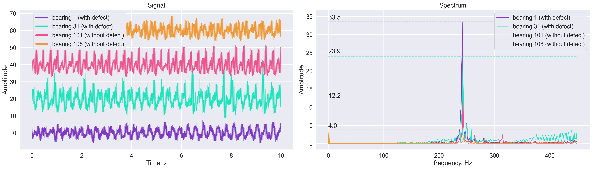

# QuantumBearings

**QuantumBearings** - project the essence of which is the classification of bearings based on their vibration signals data and machine learning methods. Project includes data collection using a device that simulates bearings` work, processing of the received data and signals classification for recognizing defective bearings.

Most of the features for working with data can be seen in this [Usage examples notebook](https://nbviewer.jupyter.org/github/RuslanBabudzhan/QuantumBearings/blob/master/notebooks/UsageExamples.ipynb "Usage examples").


## Table of Contents
_under construction_

## **Data mining**
To create dataset, a test bench has been developed and configured to simulate the operation of the rotor system. Vibration sensors have been used to monitor the state of mechanisms in an automatic mode, to classify the quality of bearings operation with machine learning methods.

<details>
<summary><b>Test bench details</b></summary>


The control unit is powered by a standard current of 220 V. Inside the control unit there is a 30 V power supply powering a motor.
External control comes from the Arduino. At the input, the Arduino receives the rotation speed, and at the output it supplies a PWM signal, the frequency of which is generated by the PID controller. The regulator has been tuned and calibrated so that the motor accelerates to 1500 rpm, then maintains this speed and then also slowly decelerates to 200 rpm. This has been done so that the experimental procedure is similar to each other for any bearing. Thus, for the further analysis it is proposed to use a stationary time section of the installation with a constant shaft rotation frequency. This is a section with an interval of 10 to 20 s.

</details>

Before experiments the bearings have been mounted on the shaft. Bearing on position 1 is constant during all experiments. This bearing is new, purchased before starting the experiments. Bearings on position 2 have been previously used in various workbenches and machines and have been replaced from one experiment to another. In this way, the device and feature generation methods aim to classify the bearings on position 2.

The first thirty defective bearings are of type 6204. The rest seventy – 6202. There also has been 7 new bearings of type 6204 and 5 bearings of type 6202.  Data collection has been performed with a sampling rate of 3000 records per second.

The data was collected according to the acceleration-hold-stop scheme. First, the rotor was accelerated to the desired speed. Then there was a 10-second hold (hereinafter the stationary interval). Then the motor stopped. The recording was carried out for the full load interval.

The resulting dataset consists of 10265700 recordings that describe rotors behavior, 91600 per bearing on average. Collecting data has been uploaded on platform Kaggle and it is in the public domain ([link](https://www.kaggle.com/isaienkov/bearing-classification)). Detailed information about resulting dataset is presented below. For classification, the collected acceleration data of bearings in three axes: X, Y, Z will be used. The name of these features contains the bearing index and the acceleration axis.


| Field            | Description                                                        | Units |
| :--------------: |:------------------------------------------------------------------ | :----:|
| Experiment ID	   | Unique identifier of the experiment                                |   -   |
| Bearing 1/2 ID   |	Unique identifier of the bearing on the first/second position   |	-   |
| Timestamp	       |Time, measured in seconds                                           |	sec |
| A1_X/Y/Z         |	Acceleration along the X, Y and Z axes for the first bearing    |  m/s2 |
| A2_X/Y/Z         |	Acceleration along the X, Y and Z axes for the second bearing   |  m/s2 |
| RPM/HZ           |	Rotation speed                                                  | rpm   |
| W	               |The motor power at a time                                           |Watts  |

## **Data processing**
Since training models on a raw signal is a very time-consuming process, it was decided to use various measures: [descriptive statistics](https://en.wikipedia.org/wiki/Descriptive_statistics), entropy ([Shannon](https://towardsdatascience.com/the-intuition-behind-shannons-entropy-e74820fe9800), [sample](https://en.wikipedia.org/wiki/Sample_entropy), [approximate](https://en.wikipedia.org/wiki/Approximate_entropy), [SVD](https://en.wikipedia.org/wiki/Singular_value_decomposition), [permutation](https://www.researchgate.net/publication/315504491_Permutation_Entropy_New_Ideas_and_Challenges)), fractal dimensions ([Petrosyan](https://hal.inria.fr/inria-00442374/document), [Higuchi](https://en.wikipedia.org/wiki/Higuchi_dimension), [Katz](https://hal.inria.fr/inria-00442374/document)), [detrended fluctuation analysis](https://en.wikipedia.org/wiki/Detrended_fluctuation_analysis), [crest factor](https://en.wikipedia.org/wiki/Crest_factor), [Hjorth parameters](https://en.wikipedia.org/wiki/Hjorth_parameters), zero crossing and [Hurst exponent](https://en.wikipedia.org/wiki/Hurst_exponent).

In order to artificially expand the dataset, splitting signals into chunks was used, so when splits_number = 10 we increase the sample 10 times, which, for example, allows us to use GridSearch more flexibly for selecting hyperparameters.
```python
from sklearn.preprocessing import StandardScaler

from source.preprocessing import splitter
from source.datamodels import iterators


stats = iterators.Stats.get_keys()
columns = ['a1_x', 'a1_y', 'a1_z', 'a2_x', 'a2_y', 'a2_z']
splitter_processor = splitter.Splitter(
    use_signal=True, 
    use_specter=True, 
    specter_threshold=500, 
    stats=stats, 
    scaler=StandardScaler())
                                       
prepared_data_our = splitter_processor.split_dataset(
    dataset, 
    stable_area=[(10, 19)], 
    splits_number=10, 
    signal_data_columns=columns)
```

## **Building models**

An example of tuning the models is available in this [GridSearch Notebook](https://nbviewer.jupyter.org/github/RuslanBabudzhan/QuantumBearings/blob/master/notebooks/GridSearch.ipynb "Usage examples").

Due to the very small amount of data, we settled on using classic machine learning models. We used such models:
1. Logistic Regression
2. Support Vector Classifier
3. Random Forest
4. K-Nearest Neighbours

We have a strong class imbalance in our dataset - 100 negative and 12 positive instances. Therefore, we use [F1 metric](https://en.wikipedia.org/wiki/F-score) as the main quality metric. We also look at other metrics such as precision and TPR. The metrics available in the project can be found as follows:
```python
from source.datamodels.iterators import Metrics


Metrics.get_keys()
```

Since there are only 112 records in our dataset, the quality of the models is highly dependent on splitting the sample into train and test subsamples. We should not use data from the same batch in both the training and the test set (the models must be able to recognize bearing signals that have not been encountered before), so we decided to use bootstrapped samples for training. Thus, we can generate an infinitely large number of values of the target metric, and average its values in order to have a stable estimate of the quality of the model.

In our work, we use scikit-learn machine learning library to build models. Thus, we can use a ready-made method for tuning the models ([Usage example](https://scikit-learn.org/stable/modules/generated/sklearn.model_selection.GridSearchCV.html "sklearn GridSearch")). But scikit-learn does not provide the ability to generate grouped train and test samples with overlaps. So, we have created a custom indices generator for our task:

```python
from source.processes.Shuffler import OverlapGroupCV


cv = OverlapGroupCV(train_size=0.7, n_repeats=100).split(X, y, groups)
```

To find the best way to classify, we tested a fairly large number of ways to process datasets. For our dataset, we considered the following options:
1. Use both signal and spectrum of all 6 axes and all 22 statistics;
2. Use statistics of signals along all 6 axes;
3. Use statistics of spectrum along all 6 axes;
4. Use both signal and spectrum statistics along Y axis.

For all options, we considered signals from both the mounted and replaceable bearing.

<details>
<summary><b>Best results for models tuning with DSM dataset</b></summary>

The best option was to train the model on signal statistics. Best F1 score: 84%


</details>

We also looked at a third party dataset (Cesar №2). We trained the models on this set, using different signal scaling before splitting into batches. So, for this dataset we considered the following options:
1. Pure signal, without scaling;
2. [Standard scale](https://scikit-learn.org/stable/modules/generated/sklearn.preprocessing.StandardScaler.html "Standard scaler");
3. [MinMax scale](https://scikit-learn.org/stable/modules/generated/sklearn.preprocessing.MinMaxScaler.html "MinMax scaler");
4. [Robust scale](https://scikit-learn.org/stable/modules/generated/sklearn.preprocessing.RobustScaler.html "Robust scaler").

You can see all the results for both datasets [here](). The charts are [here]().
## **Compare datasets**
The most important, and therefore the most difficult, is to predict the quality of bearings from one dataset on the basis of training on another. To test various techniques, third-party datasets were used: [the first](https://zenodo.org/record/3898942#.YYwp_Lp8KUnhttps://zenodo.org/record/3898942#.YYwp_Lp8KUn), [the second](https://zenodo.org/record/5084405#.YYwp_bp8KUm).

<details>
<summary><b>Cesar datasets details</b></summary>

The essence of the experiment is close to ours: data is collected from two bearings: the first is stationary and in good condition, the second removable and has 5 stages of damage: from intact to very shabby. Each experiment was run three times, to ensure that small differences due to uncontrollable variables were distributed evenly across all records.

| Parameters       | Description                                                        | Units |
| :--------------: |:------------------------------------------------------------------:| :----:|
| Experiment ID	   | Unique identifier of the experiment                                |   -   |
| Speed            | Rotor speed: 200, 350, 500                                         |  rpm  |
| Fault level      | The failure depth: F0, F1 (.006), F2 (.014), F3 (.019), F4 (.027)  |  mm   |
| Record number    | Identifier of experiment repeat: 1, 2, 3                           |   -   |
| Sample rate      | Number of records per second: 40                                   |  kHz  |
| Bearings         | FAG 22205E1K                                                       |   -   |
| Load             | Load on trabsmission: 1.4                                          | kN    |

</details>

During the exploratory data analysis, it was found that the acceleration rates in the third-party dataset are very different from ours, which is not strange: a different load on the shaft, a different type of bearings, a different rotation speed. An attempt was made to neutralize different experimental conditions using scalers: standard, robust, minmax. As expected, this did not lead to a strong improvement in the results. At the moment, other methods are being developed to bring different bearings to the same dimension.

The Shuffler.PresplitedOverlapGroupCV method was created to implement a GridSearch with dataset glued from two different datasets, where part of one is used as training data, and part of the second for test data.

```python
cv = Shuffler.PresplitedOverlapGroupCV(
    train_size=0.63, 
    n_repeats=n_repeats).split(
        X, 
        y, 
        groups=groups, 
        train_groups=cesar_groups, 
        test_groups=our_groups)

GSCV = GridSearchCV(estimator, grid, scoring=score_names, cv=cv, refit="f1")
GSCV.fit(X, y, groups=groups)
```

## **Feature selection**

In the project, the results were tested on features selected using the RFE (Recursive Feature Elimination) algorithm in order to increase the speed of calculation of experiments, as well as to get rid of features that have a negative contribution or no contribution at all.

```python
from source.preprocessing.Features_selection import Features_selection


features_df = FS.select_with_method(estimators_dict, X, y, groups)
```

<p align="center">
  
</p>

Feature selection was tested on different datasets: raw, scaled (standard, robust, minmax) and on glued datasets.

Results before and after using the selected features:


## **Results**
_under construction_
